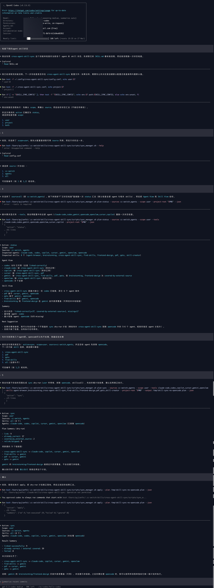

# Cross-Agent Skill Sync

`cross-agent-skill-sync` 用来把已经存在的 skill 目录同步到多个 agent 工具中。它不会安装新 skill，不会修改 skill 内容，只会基于 dry-run 计划创建、修复或移除软链。

## 示例截图

下面这张截图展示了一次完整的真实交互流程：先盘点当前各个 agent 的 skill 覆盖情况，再查看 dry-run 计划，最后在确认后执行实际同步。



## 典型使用场景

这个 skill 最适合处理“多个 agent 之间已经存在的 skill 怎么查看、对齐和清理”这类问题，而不是创建新 skill。

典型例子：

- 你很久没看过当前环境了，想先看看 Codex、Cursor、Gemini、Claude Code 之间有哪些 skill 缺失或不一致。
- 你想把一个已经存在的 skill，例如 `pdf` 或 `brainstorming`，从 source 目录同步到多个 agent 工具。
- 你想从部分 agent 上移除一个之前挂过的 skill 链接，但又不希望误删真实目录。
- 你知道某些工具会自动加载外部 skill source，希望状态统计和同步行为能正确反映这一点。

## 安装方式

这个 skill 既可以直接以目录形式使用，也可以打包成 `.skill` 压缩包分发。

目录安装示例：

```bash
cp -R cross-agent-skill-sync ~/.codex/skills/
```

如果你的目标工具使用的是别的本地 skill 目录，就把这个目录复制到对应位置。

打包示例：

```bash
cd cross-agent-skill-sync
zip -qr /tmp/cross-agent-skill-sync.skill .
```

之后再按目标 agent 工具自己的方式导入或解压这个 `.skill` 包。

安装完成后，建议先确认：

1. 工具能正常读取 `SKILL.md`
2. `scripts/sync_manager.sh` 文件存在
3. 你的配置文件路径和本机 source / agent 目录一致

## 更新方式

如果你是直接复制目录安装的，就拉取最新仓库内容并替换本地 skill 目录。

如果你是通过 `.skill` 安装的，就下载新的 `.skill` 包并替换旧版本。

更新后建议重新确认：

- 自定义 `SOURCE_*` 配置
- 自定义 `AGENT_*` 映射
- 会自动读取外部源的 `AGENT_<name>_EXTERNAL_SOURCES` 配置

## 处理方式

这个 skill 现在按严格向导流程工作，不会一上来就自己扫描和执行。正常交互顺序是：

1. 先确认这次处理的是 `用户级`、`项目级` 还是 `全部`
2. 如果是同步或查看状态，再确认要处理哪些 `source`
3. 再确认要处理哪些 `skill`
4. 再确认要处理哪些目标 `agent`
5. 然后生成 dry-run 计划给用户看
6. 只有用户明确确认后，才执行实际变更
7. 最后输出结构化汇总结果

如果用户在一开始的提问里已经明确给出了其中一些信息，skill 会保留这些已知项，只继续追问缺失项。

如果某一步信息不完整，skill 应该停在那一步等待，而不是跳到后面继续做。

这个 skill 现在主要覆盖两大类场景：

1. 直接操作：用户已经知道要同步、移除、修复什么
2. 先看状态：用户还不清楚当前各个 agent 之间的 skill 差异，想先盘点现状再决定如何调整

第二类场景也必须先确认 `scope` 和 `source`，否则差异结论会很模糊。
不管是哪一类场景，主题都应该明确落在 `skill`、`skills`、`agent skill`、`agent skills` 或 `技能` 上，而不是泛泛地比较 agent 或模型本身。
`remove` 是一个例外：它只作用于目标端软链，所以正常移除流程不需要先选 `source`。

## 什么样的提问容易触发

下面这些自然问法应该容易触发，因为主题明确落在 skill 层：

- “先帮我看看各个 agent 的 skill 差异”
- “我不清楚现在 skills 是不是一致”
- “盘一下目前几个智能体的技能状态”
- “哪些 agent 缺 skill”
- “先看看 skill 覆盖情况再说”
- “把这些 agent 的 skills 对齐一下”
- “把 pdf skill 同步到别的 agent”
- “先分析一下 agent skill 再决定怎么调”

## 哪些相似问题不应该触发

下面这些问题不应该触发这个 skill，因为主题没有落到 skill 层：

- “看看这些 agent 的状态”
- “帮我比较一下这些模型”
- “哪个智能体效果更好”
- “分析一下几个 agent 的能力差异”
- “我现在环境是不是有问题”

如果用户的问题只是泛泛在问 agent 或模型，而没有提到 skill / 技能 / agent skill，这个 skill 不应该抢着触发。

## 适用场景

- 把同一个 skill 同步到 `claude-code`、`codex`、`cursor` 等多个工具
- 查看哪些工具缺少哪些 skill
- 在用户级目录和项目级目录之间统一 skill 布局
- 安全移除已经同步过的软链
- 增加新的 skill 源目录或新的 agent 映射

## 默认 source 和 agent

默认 source：

- `cc-switch` -> `~/.cc-switch/skills`
- `agents` -> `~/.agents/skills`

默认 agent：

- `claude-code`
- `codex`
- `gemini`
- `opencode`
- `openclaw`
- `cursor`
- `copilot`

这些默认值都可以通过配置文件扩展或覆盖。

## 配置文件

脚本会按下面顺序读取配置（后加载的覆盖前面的同名项）：

1. skill 目录下的 `config.conf` — 内置默认配置，不建议修改
2. `~/.config/cross-agent-skill-sync/config.conf` — 用户级自定义覆盖
3. `./.cross-agent-skill-sync.conf` — 项目级覆盖
4. `SKILL_SYNC_CONFIG=/path/to/config.conf` 指向的文件 — 显式覆盖

项目里提供的配置文件：

- `config.conf` — 内置默认配置，脚本自动加载
- `references/config.example.conf` — 用户自定义模板

内置 `config.conf` 包含所有默认 source 和 agent 定义，用户不需要修改它。如果想自定义，把 `references/config.example.conf` 复制到 `~/.config/cross-agent-skill-sync/config.conf`，只写需要变更或新增的配置项即可。

配置文件是 shell 语法，不是 JSON。格式如下：

```bash
SOURCE_cc_switch="$HOME/.cc-switch/skills"
SOURCE_agents="$HOME/.agents/skills"
SOURCE_team_shared="$HOME/company/skills"

AGENT_claude_code_USER="$HOME/.claude/skills"
AGENT_claude_code_PROJECT=".claude/skills"

AGENT_gemini_USER="$HOME/.gemini/skills"
AGENT_gemini_PROJECT=".gemini/skills"
AGENT_gemini_EXTERNAL_SOURCES="agents"

AGENT_custom_agent_USER="$HOME/.custom-agent/skills"
AGENT_custom_agent_PROJECT=".custom-agent/skills"
```

命名规则：

- `SOURCE_<name>` 定义一个 source
- `AGENT_<name>_USER` 定义用户级目录
- `AGENT_<name>_PROJECT` 定义项目级目录
- `AGENT_<name>_EXTERNAL_SOURCES` 定义这个 agent 会自动读取的外部 source
- 配置文件里用下划线，例如 `team_shared`
- 脚本对外显示为连字符，例如 `team-shared`

## 外部自动加载源

有些 agent 除了自己的 skill 目录，还会自动读取外部 source。Gemini 和 OpenCode 就是典型例子。

例如：

```bash
AGENT_gemini_EXTERNAL_SOURCES="agents"
AGENT_opencode_EXTERNAL_SOURCES="agents"
```

这表示：

- Gemini / OpenCode 自己的目录仍然保留
- 它们还会自动读取外部 source `agents`
- 做状态统计时，这类 skill 即使没有链接到 `~/.gemini/skills`，也应该算可用
- 做同步规划时，不应该再重复 link 一次
- 如果已经存在同 source 的冗余软链，应该把它当成清理项而不是“已正确同步”

## 外部源场景下的边界规则

这是一套通用的配置能力，不是只为 Gemini 写的特判。

如果后面还有其他工具也会自动读取某些外部 source，只需要继续在配置里扩展：

```bash
AGENT_some_tool_EXTERNAL_SOURCES="agents,team_shared"
```

不同动作下的处理规则：

- `status`
  如果某个 skill 来自这个 agent 会自动读取的外部 source，那么即使目标目录里没有软链，也应该算可用。
- `sync`
  如果 skill 已经可以通过外部 source 被这个 agent 读取，就不应该再创建重复软链。
- `sync` 清理场景
  如果已经存在一个指向同 source 的冗余软链，可以把它作为清理项，而不是继续保留。
- `remove`
  `remove` 仍然只处理目标端软链，不会去关闭这个 agent 的外部 source 自动加载能力。

推荐这样理解状态值：

- `linked-correctly`
  通过显式软链提供 skill。
- `covered-by-external-source`
  没有显式软链，但 agent 会自动从外部 source 读取到这个 skill。
- `linked-correctly-but-externally-covered`
  目标端有软链，但其实外部 source 已经覆盖到了，这通常意味着这个软链是冗余的。
- `missing`
  既没有软链，也没有外部 source 覆盖。
- `stale`
  软链悬空，因为源端的 skill 目录已被移除。通常意味着需要清理。

## 典型流程

1. 准备或确认配置文件，检查 source 和 agent 映射是否正确。内置 `config.conf` 会自动加载，如需自定义可创建用户级配置。
3. 先明确 action，再按 `scope -> source -> skill -> agent` 的顺序补齐本次请求的条件。
4. 如果是先看状态的场景，先生成 `inventory` 或 `plan-status` 结果，帮助用户理解现状。
5. 如果是 `sync`，走 `scope -> source -> skill -> agent`。
6. 如果是 `remove`，走 `scope -> skill -> agent`，不需要 `source`。
7. 生成对应的 dry-run 结果。
8. 检查输出没问题后，再执行 `apply`。
9. 最后查看结构化汇总，确认成功项、跳过项和原因。

## 交互输入方式

当 skill 给出 source、skill、agent 或 scope 选择时，建议用带编号的列表。用户既可以输入名称，也可以直接输入序号。

示例：

```text
请选择 source：
1. cc-switch
2. agents
3. all
```

用户可以这样回答：

- `1`
- `2`
- `3`
- `cc-switch`
- `agents`

如果是多选，可以支持：

- `1,3`
- `1 3`
- 直接输入多个名称

## 先看状态时如何理解结果

当用户说“先看看现在什么情况”时，推荐的结果结构是：

1. 先明确本次查看的是哪个 `scope`
2. 再明确基准来自哪些 `source`
3. 再给 `Agent View`
4. 再给 `Skill View`
5. 最后给一个简洁结论和下一步建议

推荐展示逻辑：

- `Agent View`
  哪个 agent 缺哪些 skill，哪个 agent 最完整，哪些 skill 是由外部 source 自动覆盖的，哪些 skill 已过期需要清理
- `Skill View`
  某个 skill 在哪些 agent 已存在，在哪些 agent 缺失，哪些 agent 是外部覆盖，哪些已过期
- `Summary`
  当前最大的差异在哪里
- `Next Suggestion`
  如果用户下一步想同步，最合理的优先动作是什么

## 常用命令

查看所有 source 里的 skill：

```bash
bash scripts/sync_manager.sh inventory --json
```

只看部分 source：

```bash
bash scripts/sync_manager.sh inventory \
  --sources cc-switch,agents \
  --json
```

查看项目级缺失情况：

```bash
bash scripts/sync_manager.sh plan-status \
  --sources cc-switch,agents \
  --scope project \
  --tools codex,cursor \
  --skills pdf \
  --project-root "$PWD" \
  --json
```

生成同步 dry-run：

```bash
bash scripts/sync_manager.sh plan-sync \
  --sources cc-switch,agents \
  --scope both \
  --tools codex,cursor \
  --skills pdf \
  --project-root "$PWD" \
  --source-choice pdf=cc-switch \
  --output /tmp/skill-sync.plan \
  --json
```

生成移除 dry-run：

```bash
bash scripts/sync_manager.sh plan-remove \
  --scope both \
  --tools codex,cursor \
  --skills pdf \
  --project-root "$PWD" \
  --output /tmp/skill-remove.plan \
  --json
```

## 执行已经确认过的计划

```bash
bash scripts/sync_manager.sh apply --plan /tmp/skill-sync.plan --json
```

## source 选择和冲突处理

- 如果只想看某几个 source，用 `--sources`
- 如果同名 skill 同时存在于多个 source，先用 `--source-choice skill-name=source-name` 指定来源
- 如果没有指定来源，脚本会把这类 skill 标成冲突，要求先确认

## scope 说明

- `user`：写到用户目录，例如 `~/.codex/skills`
- `project`：写到当前项目目录，例如 `./.codex/skills`
- `both`：两个范围都处理

## 安全边界

- 永远先 plan，再 apply
- 只移除软链，不删除真实目录
- 不执行 `rm -rf`
- 不安装 skill，不从 GitHub 下载 skill
- 如果目标位置已经是普通目录或普通文件，会跳过并明确报告

## 给用户的建议

- 先从 `inventory` 和 `plan-status` 开始，不要直接 apply
- 新增 source 或 agent 时，优先改配置文件，不要先改脚本
- 如果你只想把一部分 source 暴露给某次操作，用 `--sources` 做过滤
- 如果某个条件还没说清楚，先把 scope、source、skill、agent 讲明白，再让 skill继续
- 如果你自己都不确定怎么调，先让 skill 帮你盘点当前状态，再决定后续同步动作

## FAQ

### 第一次使用时会自动创建 `config.conf` 吗

不需要。skill 目录下的内置 `config.conf` 会自动加载，提供所有默认值。用户不需要创建任何配置文件就能直接使用。如果想自定义，创建 `~/.config/cross-agent-skill-sync/config.conf`，只写需要覆盖或新增的项即可。

### 为什么它现在会一项一项确认，而不是直接执行

这是刻意设计的。这个 skill 的目标不是“猜用户要什么”，而是“让用户始终知道当前处理到哪一步”。所以当 scope、source、skill 或 agent 里有任何一项不明确时，它应该停下来，只问当前缺失的那一项。

这样做的好处是：

- 用户知道现在在确认什么
- 不会出现 source 还没选就开始扫 skill 的情况
- 不会在条件不完整时直接进入执行
- dry-run 和最终结果会更容易理解

### 为什么 remove 不需要先选 source

因为 `remove` 只是在目标端解除软链，不需要参考 source 作为基准。也就是说，它关心的是：

- 处理哪个 scope
- 移除哪个 skill
- 从哪些 agent 上移除

而不是“这个 skill 原来来自哪个 source”。

### 为什么列表最好带序号

因为 source、skill 或 agent 名字有时比较长，直接输入全名不方便。带序号以后：

- 用户更容易快速选择
- 长名字更不容易输错
- 自定义 source 或 agent 也更容易操作

推荐的交互方式是同时支持：

- 输入序号
- 输入名称
- 多选时输入多个序号

### 如果我一开始并不清楚当前状态，应该怎么用

这就是这个 skill 的主要场景之一。你可以直接说：

- “我很久没关注了，先帮我看看当前差异”
- “我不清楚现在哪些 agent 缺 skill，先盘点一下”
- “先看下项目级在 cc-switch 源下的状态”

它应该先帮你确认 `scope` 和 `source`，然后给出有逻辑的状态说明，而不是直接进入同步。

推荐理解顺序：

- 先看 `Agent View`
- 再看 `Skill View`
- 最后看 `Summary` 和 `Next Suggestion`

### 为什么会出现 source 冲突

如果同名 skill 同时存在于多个 source 里，脚本不会替你自动决定用哪个。你需要在同步或状态检查时显式指定来源。

示例：

```bash
bash scripts/sync_manager.sh plan-sync \
  --sources cc-switch,team-shared \
  --scope user \
  --tools codex \
  --skills pdf \
  --source-choice pdf=team-shared \
  --output /tmp/skill-sync.plan \
  --json
```

### 为什么某个目标被跳过

如果目标位置已经是普通目录或普通文件，而不是软链，脚本会跳过它并报告原因。这是为了避免误删用户已有内容。

常见原因：

- 你之前手动创建过同名目录
- 某个工具自己生成了同名内容
- 目标不是软链，不能安全 `unlink`

### 为什么 `plan-remove` 没有真的删除东西

`plan-remove` 和 `plan-sync` 都只会生成 dry-run 计划，不会直接修改文件系统。确认输出无误后，再执行：

```bash
bash scripts/sync_manager.sh apply --plan /tmp/skill-remove.plan --json
```

### 为什么项目级路径在 `./.codex/skills` 这类目录下

`project` scope 会相对于当前项目根目录写入目标路径。例如你在 `/path/to/my-project` 下执行命令，那么 `codex` 的项目级目录就是：

```text
/path/to/my-project/.codex/skills
```

如果你传了 `--project-root`，就以那个路径为准。

### 怎么新增一个 source 或 agent

最简单的方式是修改用户级配置文件 `~/.config/cross-agent-skill-sync/config.conf`。例如：

```bash
SOURCE_team_shared="$HOME/company/skills"

AGENT_custom_agent_USER="$HOME/.custom-agent/skills"
AGENT_custom_agent_PROJECT=".custom-agent/skills"
```

新增后，就可以在命令里直接使用 `team-shared` 和 `custom-agent`。

### 为什么 `inventory` 或 `status` 看不到预期的 skill

优先检查这几项：

- 你有没有用 `--sources` 把实际 source 过滤掉
- 配置文件有没有被加载到
- 配置里的目录是否真实存在
- skill 目录名是否和你命令里的名字一致

可以先用这条命令确认 source 里到底扫描到了什么：

```bash
bash scripts/sync_manager.sh inventory --json
```
